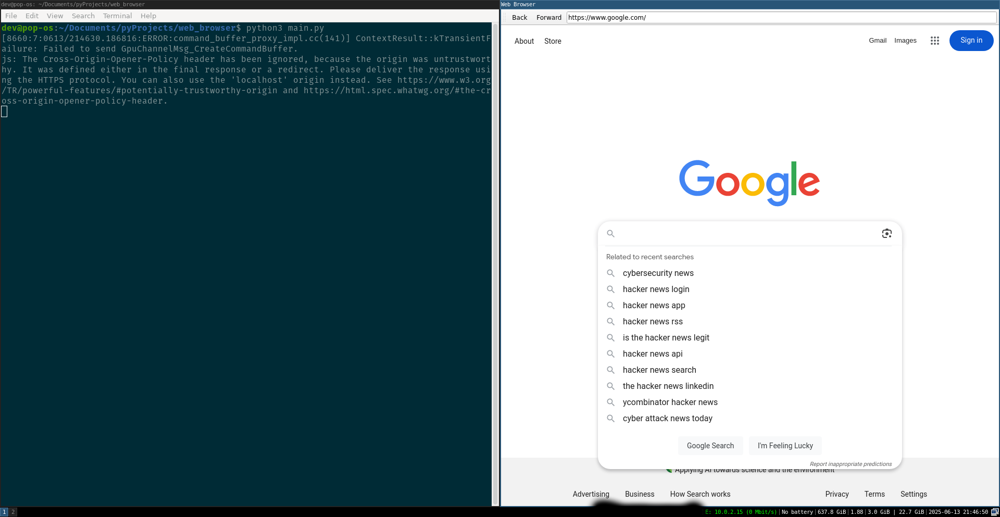

# Simple Web Browser

A basic web browser built using PyQt5 and QtWebEngineWidgets.

## Features

* Navigate to URLs
* Back and forward buttons
* URL bar with autocomplete
* Clear browsing data and close browser

## Screenshot

## Requirements

* Python 3.x
* PyQt5
* QtWebEngineWidgets

## Usage

1. Clone the repository
2. Run `python main.py` to launch the browser

## License

This project is licensed under the MIT License. See LICENSE for details.
